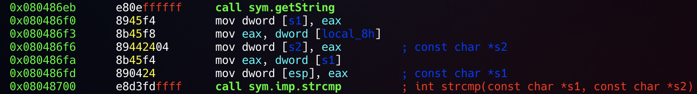
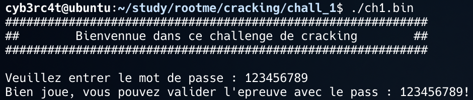

## ELF x86 - 0 protection

*Objective* : Passing a simple authentication by finding the target string that is going to be compared with my input

1. unzip the file
2. reverse the binary using radare2
3. The target string is located in local_8 [ebp-0x8]

4. The target string has the value of "123456789"

5. Enter the password "123456789"
